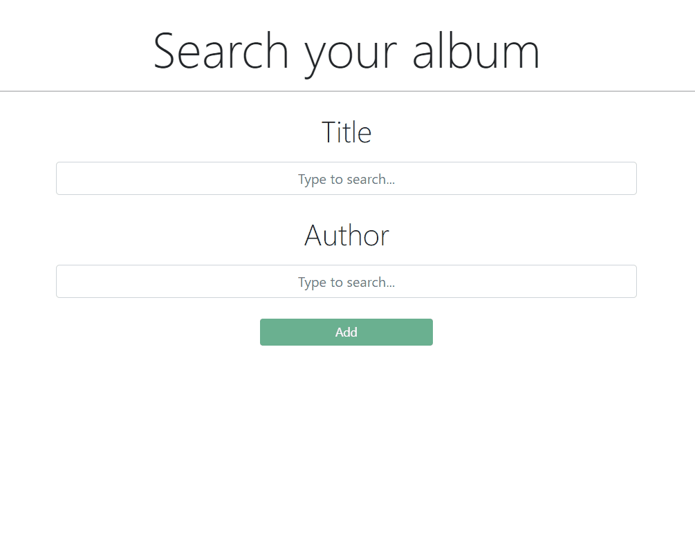

<h2> Interfaz de usuario al que se le pueda dar el título y el autor de una 
canción mediante un formulario y muestre la carátula de la canción o del álbum al 
que pertenece en su defecto.

<h3> Para extraer la carátula se usará la API de iTunes 
(https://developer.apple.com/library/archive/documentation/AudioVideo/Conceptual/i
TuneSearchAPI/SearchExamples.html#//apple_ref/doc/uid/TP40017632-CH6-SW1) 

